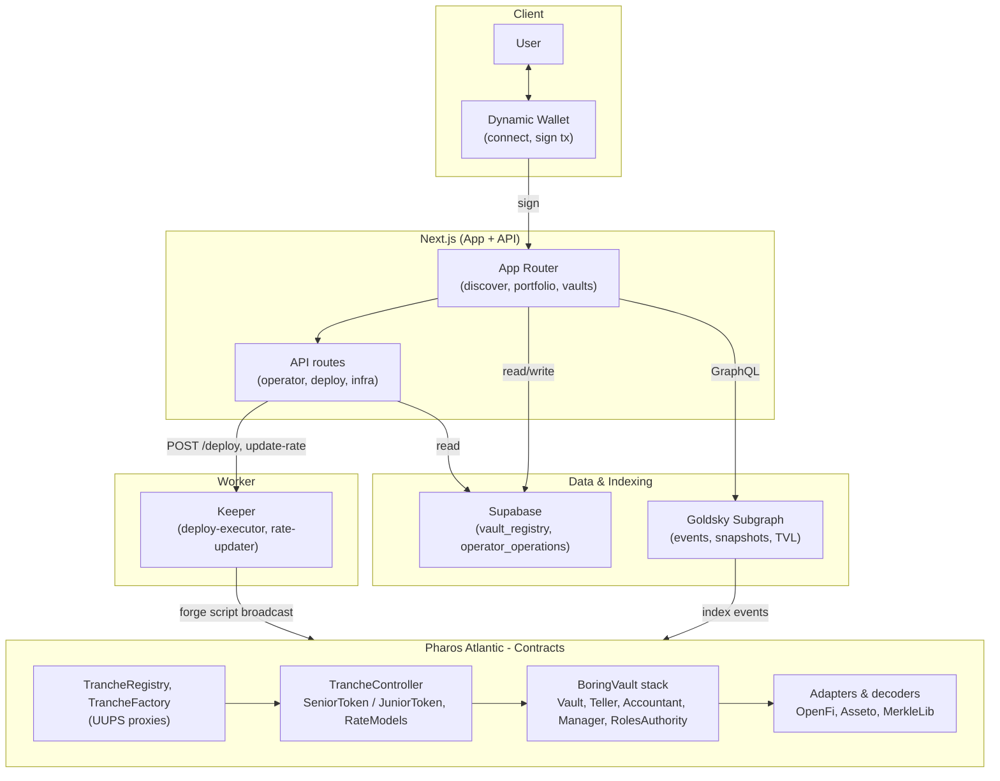

# Pontus Vault

Pontus Vault is tranche vault infrastructure on Pharos. It packages yield strategies into tiered vault structures that are easy to understand, integrate, and distribute.

## Architecture



**Overview**
- Tiered risk/return vault sleeves backed by the same strategy pool
- A consistent vault interface for pricing, performance, and redemptions
- A strategy library spanning DeFi and real-world yield (treasuries, money markets, private credit, market-neutral, etc.)
- Yield that accrues into value automatically (no “claim yield” UX)
- White-label distribution for wallets, exchanges, and fintechs

**Stack**
- Frontend: Next.js (App Router)
- Contracts: Foundry + BoringVault
- Indexer: Goldsky
- Keeper: Node.js worker (scheduled accountant exchange-rate updates)
- DB: Supabase
- Backend: Next.js API routes (thin BFF)
- Monorepo: pnpm + Turbo

**Repo Structure**
- `apps/web`: Next.js app (wallet connect, UI, thin API routes)
- `apps/indexer`: Goldsky subgraph (deployable indexer service)
- `apps/keeper`: scheduled worker for `updateExchangeRate` execution
- `contracts`: Foundry workspace (BoringVault stack + tranche wrapper)
- `packages/shared`: shared types/constants
- `supabase`: schema, migrations, seeds

Why this layout: `apps/` contains deployable apps/services, `packages/` contains shared code, and `contracts/` stays isolated for Foundry tooling.

**Prerequisites**
- Node.js `>=20`
- `pnpm`
- Foundry toolchain (`forge`, `cast`)
- Goldsky CLI (for indexer deploys)
- Supabase CLI (optional, for local DB work)

**Install**
```bash
pnpm install
```

**Common Commands**
```bash
pnpm dev
pnpm build
pnpm test
pnpm lint
pnpm keeper:start
pnpm keeper:once
pnpm --filter @pti/keeper start:deploy-executor
pnpm --filter @pti/contracts deps
pnpm --filter @pti/contracts test:fork
pnpm --filter @pti/contracts deploy:infra
pnpm --filter @pti/contracts deploy:vault
pnpm --filter @pti/contracts keeper:update-rate
```

**End-to-End Runbook (Create Vault -> Index -> Operate)**
1. Deploy core infra (UUPS registry/factory):
   `pnpm --filter @pti/contracts deploy:infra`
2. Deploy one vault stack (BoringVault + teller + accountant + manager + tranche set):
   `pnpm --filter @pti/contracts deploy:vault`
3. Record deploy outputs:
   persist `controller`, `seniorToken`, `juniorToken`, `vault`, `teller`, `manager`, `paramsHash` in `supabase.vault_registry`.
4. Point indexer to your registry:
   run `contracts/script/update-indexer-subgraph.sh --registry <TRANCHE_REGISTRY> --start-block <DEPLOY_START_BLOCK>`
   (or edit `apps/indexer/subgraph.yaml` manually), then verify `dataSources[0].source.address` and `startBlock`.
5. Build and deploy subgraph:
   `pnpm --filter @pti/indexer build`
   `pnpm --filter @pti/indexer deploy`
6. Enable live data path:
   set `DATA_SOURCE=live`, `SUPABASE_URL`, `SUPABASE_SERVICE_ROLE_KEY`, and `INDEXER_URL`.
7. Start keeper for accountant updates:
   `pnpm keeper:start` (or one-off: `pnpm keeper:once`).
8. Run operator workflows from `/operator`:
   configure vault profile/caps/routes, then execute rebalance with `raise-cash` intent before large redemptions when needed.

## Example Deployments (Pharos Atlantic)

These addresses are provided as a concrete reference for demos, indexer wiring, and UI live mode.

- Network: Pharos Atlantic testnet
- Chain ID: `688689`
- Explorer: https://atlantic.pharosscan.xyz/
- Last updated: 2026-02-09

### Infra (UUPS Proxies + Implementations)

| Component | Address | Verified | Notes |
|---|---:|---:|---|
| TrancheRegistry (proxy) | `0x341A376b59c86A26324229cd467A5E3b930792C6` | ✅ | OZ `ERC1967Proxy` |
| TrancheFactory (proxy) | `0x7fBaFFA7fba0C6b141cf06B01e1ba1f6FB2350F8` | ✅ | OZ `ERC1967Proxy` |
| TrancheRegistry (impl) | `0xeab73FD82e5406858e287e33D825c3B2c83a146D` | ✅ | UUPS implementation |
| TrancheFactory (impl) | `0x69F7Ca00E83828a8362865E5877E75b9b657fb77` | ✅ | UUPS implementation |
| TrancheController (impl) | `0x40873215773169F1D8adF8d03EB8f355e90ED2d8` | ✅ | EIP-1167 clone target |
| TrancheToken (impl) | `0x4b2D7C56A211506f89238Cff7e0d96771603bEF5` | ✅ | EIP-1167 clone target |

### Demo Vault (USDT)

- Asset: USDT `0xE7E84B8B4f39C507499c40B4ac199B050e2882d5`
- Params hash: `0x0cdf7da3e5832884a02221b487938de04986c8c1afb518e1e1e35535b7a81b70`

| Component | Address | Verified | Notes |
|---|---:|---:|---|
| TrancheController | `0x9E221E5f409e13B1d90442Bda17F3c2989F4728E` | n/a | EIP-1167 clone -> `TrancheController (impl)` |
| SeniorToken | `0xAD7F02a52B9bB3574B9130a4643F3Eb8Cc5f8563` | n/a | EIP-1167 clone -> `TrancheToken (impl)` |
| JuniorToken | `0xb8E36aA4328eBFa45a727409Dea4e2C0484B5c49` | n/a | EIP-1167 clone -> `TrancheToken (impl)` |
| BoringVault | `0x86717d6E7e8c022b7f64bdbE19c2e503E0c402A4` | ✅ | Vault core |
| Accountant | `0x729D68f666B57BaAa4239fcA6EC75891460722f2` | ✅ | `AccountantWithRateProviders` |
| Teller | `0xB85f846fd8819275b95F2Be5db3E58367D48CEE2` | ✅ | `TellerWithMultiAssetSupport` |
| Manager | `0x75b0E8867711e937F46737DC744fDCb4A175B83A` | ✅ | `ManagerWithMerkleVerification` |
| RolesAuthority | `0x94E5F8476639096670e86207c8f94e171586011E` | ✅ | Solmate `RolesAuthority` |
| WETH (local) | `0xD511a81ece0bCDA92Cae441809e3A96A718E9589` | ✅ | Local WETH helper for teller |
| OpenFi decoder | `0xfF742317CE7E6eef61BbCDae3D850d3D9B4ff4E8` | ✅ | `OpenFiDecoderAndSanitizer` |
| Asseto decoder | `0x92A1a7f8244c251F884d5BC89BbadbF93F424D0E` | ✅ | `AssetoDecoderAndSanitizer` |

### Indexer (Goldsky)

- GraphQL endpoint:
  `https://api.goldsky.com/api/public/project_cly6pszz9vs2p01249oib4l5x/subgraphs/pontus-vault/0.1.0/gn`

Example query (vault overview):
```graphql
query VaultOverview($id: ID!) {
  vault(id: $id) {
    id
    paramsHash
    asset
    tvl
    seniorPrice
    juniorPrice
    seniorSupply
    juniorSupply
    seniorDebt
    updatedAt
    createdAt
  }
}
```

Example curl:
```bash
INDEXER_URL="https://api.goldsky.com/api/public/project_cly6pszz9vs2p01249oib4l5x/subgraphs/pontus-vault/0.1.0/gn"
curl "$INDEXER_URL" -H 'content-type: application/json' --data '{
  "query":"query($id:ID!){vault(id:$id){id paramsHash asset tvl seniorPrice juniorPrice seniorSupply juniorSupply seniorDebt updatedAt createdAt}}",
  "variables":{"id":"0x9e221e5f409e13b1d90442bda17f3c2989f4728e"}
}'
```

**Manual vs Server-Side Execution**
- Manual execution:
  best for bootstrap deploys, one-off maintenance, and break-glass operations.
- Server-side execution:
  best for recurring jobs (keeper rate updates, scheduled rebalance, operation persistence).
- Recommended:
  hybrid model. Keep deploy + emergency actions manual; move repetitive tasks to server workers/API with logs and idempotency keys.

**BoringVault Dependency**
Install once inside `contracts/` (commit pinned):
```bash
cd contracts
forge install Se7en-Seas/boring-vault@0e23e7fd3a9a7735bd3fea61dd33c1700e75c528 --no-git
```

**Notes**
- `docs/PRD.md` and `plan.md` are intentionally gitignored per request.
- Frontend data source is switchable via `DATA_SOURCE` / `NEXT_PUBLIC_DATA_SOURCE` using `demo` or `live`.
- Live data mode expects server envs: `SUPABASE_URL`, `SUPABASE_SERVICE_ROLE_KEY`, and `INDEXER_URL`.
- Wallet connect uses Dynamic; set `NEXT_PUBLIC_DYNAMIC_ENVIRONMENT_ID` to enable the connect widget.
- Operator flow uses `Next.js API + wallet-signed step runner`:
  - `POST/GET /api/operator/operations`
  - `GET /api/operator/operations/:operationId`
  - `PATCH /api/operator/operations/:operationId/steps/:stepIndex`
  - `POST /api/operator/deploy` (UI-triggered deploy automation; server-side executor)
  - `POST /api/operator/accountant/update-rate` (UI-triggered `updateExchangeRate` execution)
  - `GET /api/operator/infra` (returns current `TRANCHE_FACTORY` / `TRANCHE_REGISTRY` bindings)
  - `PATCH /api/operator/vaults/:vaultId` (vault profile metadata: name/summary/risk/status/order/tags)
- Operator persistence tables are `operator_operations` and `operator_operation_steps` in Supabase.
- `NEXT_PUBLIC_OPERATOR_TX_MODE=send_transaction` enables direct wallet tx broadcast on onchain steps; default behavior is `sign_only`.
- `OPERATOR_ADMIN_ADDRESSES` can lock operator write actions to a comma-separated wallet allowlist; in `demo` mode an empty allowlist is allowed.
- Deploy automation options:
  - local Forge mode (`DEPLOYER_PRIVATE_KEY`, `TRANCHE_FACTORY`, `CONTRACTS_WORKSPACE_DIR`)
  - remote worker mode (`DEPLOY_EXECUTOR_URL`, optional `DEPLOY_EXECUTOR_TOKEN`)
- Contracts test layers include unit, integration (self-deployed BoringVault stack), fork (OpenFi on Atlantic), and invariant suites.
- Tranche deposits can be guarded by accountant rate staleness (`maxRateAge`), so production should run the keeper worker continuously.
- Hybrid withdraw with tranche `QueueAdapter` is tracked as a future roadmap item in `contracts/README.md` (deferred in the current release).
- `CapSafetyRateModel` consumes `IRefRateProvider` only. To use a real external protocol rate, deploy an adapter that implements `IRefRateProvider` and normalizes output to `per-second WAD`.
- Reference implementation: `OpenFiRayRateAdapter` + `IOpenFiRateSource` for `ray/year -> per-second WAD` normalization.
- If you add a new workspace, update `pnpm-workspace.yaml` and root scripts.
- Dependencies are pinned to exact versions; update intentionally when needed.
- Pharos Atlantic chain id is standardized as `688689` across wallet network config, deploy scripts, and keeper jobs.
