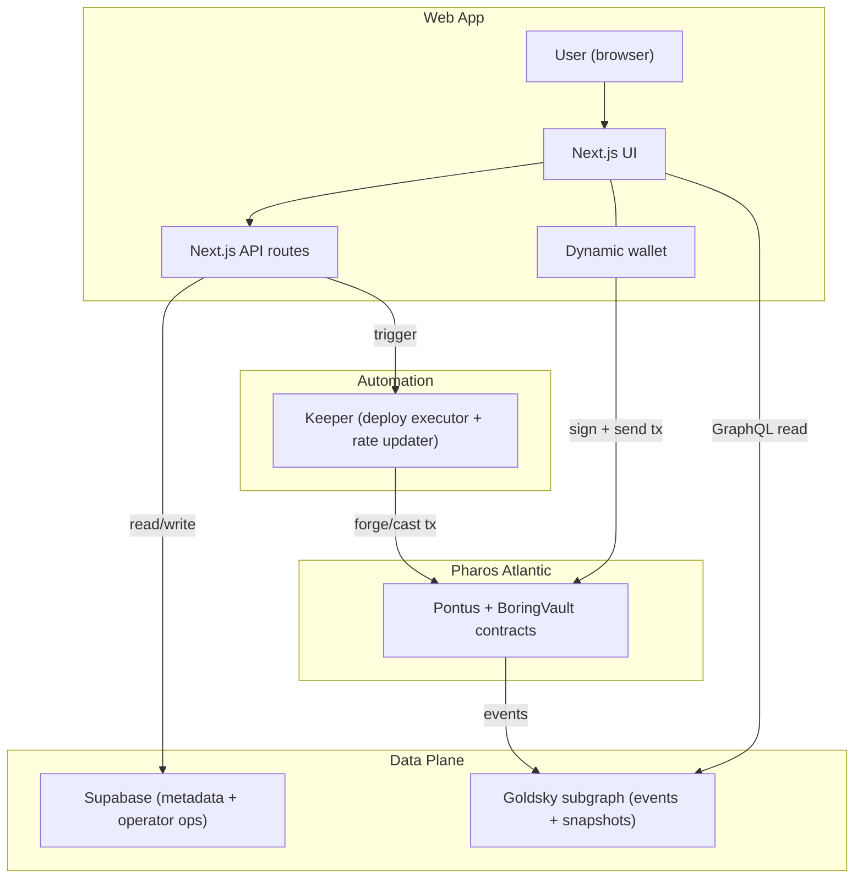

# Pontus Vault

Pontus Vault is structured-yield vault infrastructure on Pharos. It packages one strategy stack into multiple risk sleeves, with consistent pricing, accounting, and redemption UX.

## Architecture



## Monorepo Layout

- `apps/web`: Next.js app (discover, vault detail, portfolio, operator UI)
- `apps/indexer`: Goldsky subgraph (events, hourly/daily snapshots)
- `apps/keeper`: lightweight worker for deploy execution and rate updates
- `packages/shared`: shared types and chain constants
- `supabase`: metadata + operator ops persistence
- `contracts`: Foundry workspace (BoringVault stack + tranche wrapper)

## Quickstart

```bash
pnpm install
pnpm dev
```

Default is demo data and requires no secrets. For live mode, start from `.env.example`.

## Deployments (Pharos Atlantic)

- Chain ID: `688689`
- Explorer: `https://atlantic.pharosscan.xyz`
- Last updated: 2026-02-09

### Infra (UUPS Proxies + Implementations)

| Component | Address | Verified | Notes |
|---|---:|---:|---|
| TrancheRegistry (proxy) | [`0x341A376b59c86A26324229cd467A5E3b930792C6`](https://atlantic.pharosscan.xyz/address/0x341A376b59c86A26324229cd467A5E3b930792C6) | ✅ | OZ `ERC1967Proxy` |
| TrancheFactory (proxy) | [`0x7fBaFFA7fba0C6b141cf06B01e1ba1f6FB2350F8`](https://atlantic.pharosscan.xyz/address/0x7fBaFFA7fba0C6b141cf06B01e1ba1f6FB2350F8) | ✅ | OZ `ERC1967Proxy` |
| TrancheRegistry (impl) | [`0xeab73FD82e5406858e287e33D825c3B2c83a146D`](https://atlantic.pharosscan.xyz/address/0xeab73FD82e5406858e287e33D825c3B2c83a146D) | ✅ | UUPS implementation |
| TrancheFactory (impl) | [`0x69F7Ca00E83828a8362865E5877E75b9b657fb77`](https://atlantic.pharosscan.xyz/address/0x69F7Ca00E83828a8362865E5877E75b9b657fb77) | ✅ | UUPS implementation |
| TrancheController (impl) | [`0x40873215773169F1D8adF8d03EB8f355e90ED2d8`](https://atlantic.pharosscan.xyz/address/0x40873215773169F1D8adF8d03EB8f355e90ED2d8) | ✅ | EIP-1167 clone target |
| TrancheToken (impl) | [`0x4b2D7C56A211506f89238Cff7e0d96771603bEF5`](https://atlantic.pharosscan.xyz/address/0x4b2D7C56A211506f89238Cff7e0d96771603bEF5) | ✅ | EIP-1167 clone target |

### Demo Vault (USDT)

- Asset: USDT [`0xE7E84B8B4f39C507499c40B4ac199B050e2882d5`](https://atlantic.pharosscan.xyz/address/0xE7E84B8B4f39C507499c40B4ac199B050e2882d5)
- Params hash: `0x0cdf7da3e5832884a02221b487938de04986c8c1afb518e1e1e35535b7a81b70`

| Component | Address | Verified | Notes |
|---|---:|---:|---|
| TrancheController | [`0x9E221E5f409e13B1d90442Bda17F3c2989F4728E`](https://atlantic.pharosscan.xyz/address/0x9E221E5f409e13B1d90442Bda17F3c2989F4728E) |  | EIP-1167 clone |
| SeniorToken | [`0xAD7F02a52B9bB3574B9130a4643F3Eb8Cc5f8563`](https://atlantic.pharosscan.xyz/address/0xAD7F02a52B9bB3574B9130a4643F3Eb8Cc5f8563) |  | EIP-1167 clone |
| JuniorToken | [`0xb8E36aA4328eBFa45a727409Dea4e2C0484B5c49`](https://atlantic.pharosscan.xyz/address/0xb8E36aA4328eBFa45a727409Dea4e2C0484B5c49) |  | EIP-1167 clone |
| BoringVault | [`0x86717d6E7e8c022b7f64bdbE19c2e503E0c402A4`](https://atlantic.pharosscan.xyz/address/0x86717d6E7e8c022b7f64bdbE19c2e503E0c402A4) | ✅ | Vault core |
| Accountant | [`0x729D68f666B57BaAa4239fcA6EC75891460722f2`](https://atlantic.pharosscan.xyz/address/0x729D68f666B57BaAa4239fcA6EC75891460722f2) | ✅ | `AccountantWithRateProviders` |
| Teller | [`0xB85f846fd8819275b95F2Be5db3E58367D48CEE2`](https://atlantic.pharosscan.xyz/address/0xB85f846fd8819275b95F2Be5db3E58367D48CEE2) | ✅ | `TellerWithMultiAssetSupport` |
| Manager | [`0x75b0E8867711e937F46737DC744fDCb4A175B83A`](https://atlantic.pharosscan.xyz/address/0x75b0E8867711e937F46737DC744fDCb4A175B83A) | ✅ | `ManagerWithMerkleVerification` |
| RolesAuthority | [`0x94E5F8476639096670e86207c8f94e171586011E`](https://atlantic.pharosscan.xyz/address/0x94E5F8476639096670e86207c8f94e171586011E) | ✅ | Solmate `RolesAuthority` |
| WETH (local) | [`0xD511a81ece0bCDA92Cae441809e3A96A718E9589`](https://atlantic.pharosscan.xyz/address/0xD511a81ece0bCDA92Cae441809e3A96A718E9589) | ✅ | local helper for teller |
| OpenFi decoder | [`0xfF742317CE7E6eef61BbCDae3D850d3D9B4ff4E8`](https://atlantic.pharosscan.xyz/address/0xfF742317CE7E6eef61BbCDae3D850d3D9B4ff4E8) | ✅ | `OpenFiDecoderAndSanitizer` |
| Asseto decoder | [`0x92A1a7f8244c251F884d5BC89BbadbF93F424D0E`](https://atlantic.pharosscan.xyz/address/0x92A1a7f8244c251F884d5BC89BbadbF93F424D0E) | ✅ | `AssetoDecoderAndSanitizer` |

## Indexer (Goldsky)

- GraphQL endpoint:
  `https://api.goldsky.com/api/public/project_cly6pszz9vs2p01249oib4l5x/subgraphs/pontus-vault/0.1.0/gn`
- Sample queries: `docs/indexer-query.graphql`

## Tests

```bash
pnpm test
pnpm --filter @pti/web lint
pnpm --filter @pti/indexer build
pnpm --filter @pti/contracts test
```

## BoringVault Dependency (Contracts)

```bash
cd contracts
forge install Se7en-Seas/boring-vault@0e23e7fd3a9a7735bd3fea61dd33c1700e75c528 --no-git
```
