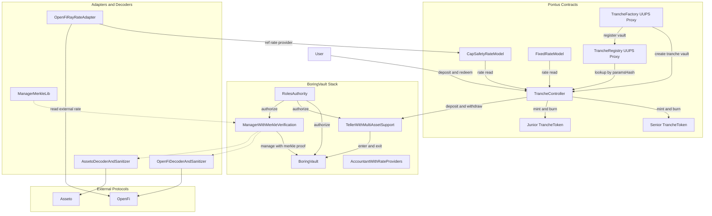

# Contracts (Foundry)

This workspace holds the BoringVault stack integration and tranche wrapper contracts.

**Structure**
- `src/tranche/`: tranche controller/factory/registry/token contracts
- `src/rate-models/`: tranche rate model implementations
- `src/decoders/`: manager decoder/sanitizer implementations
- `src/libraries/`: constants + external protocol calldata builders + merkle helper
- `src/interfaces/tranche/`: tranche controller/factory/registry/token interfaces
- `src/interfaces/rates/`: shared + model-specific rate interfaces
- `src/interfaces/openfi/`: OpenFi-facing interfaces
- `src/interfaces/asseto/`: Asseto-facing interfaces
- `src/interfaces/decoders/`: decoder format interfaces
- `script/DeployInfra.s.sol`: one-time infra deploy (UUPS `TrancheRegistry` + `TrancheFactory` proxies + implementations)
- `script/DeployTrancheVault.s.sol`: per-vault deploy (BoringVault set + manager + decoder + tranche vault creation)
- `script/Deploy.s.sol`: backward-compatible alias to `DeployInfra.s.sol`
- `script/BaseScript.sol`: shared script env helpers
- `script/UpdateExchangeRate.s.sol`: updater tick for accountant exchange rate
- `test/unit`: isolated logic tests
- `test/integration`: full self-deployed BoringVault assembly tests
- `test/fork`: Atlantic fork tests
- `test/invariant`: property-based tests

**Upgradeability**
- `TrancheRegistry` and `TrancheFactory` are deployed behind UUPS proxies.
- Both contracts use ERC-7201 namespaced storage (`@custom:storage-location`) instead of storage gaps.

**BoringVault Dependency**
```bash
forge install Se7en-Seas/boring-vault@0e23e7fd3a9a7735bd3fea61dd33c1700e75c528 --no-git
```
This repo vendors the pinned commit in `contracts/lib/boring-vault`; keep it in place for local builds.
`script/install-deps.sh` applies a minimal, deterministic teller import patch because Foundry cannot safely remap BoringVault's `src/...` imports in this workspace.

**Upstream Baseline**
- Upstream repository: `https://github.com/Se7en-Seas/boring-vault`
- Pontus contract stack is built on top of commit:
  `0e23e7fd3a9a7735bd3fea61dd33c1700e75c528`
- Local vendored path:
  `contracts/lib/boring-vault`

**Contract Architecture**


**BoringVault Deployment Helpers (Reference Only)**
- `contracts/lib/boring-vault/script/ArchitectureDeployments/DeployArcticArchitecture.sol`: baseline wiring for BoringVault + accountant + manager/roles.
- `contracts/lib/boring-vault/script/DeployTeller.s.sol`: teller deployment flow to adapt for Pharos/Atlantic assets.
- `contracts/lib/boring-vault/script/DeployDecoderAndSanitizer.s.sol`: decoder/allowlist scaffolding (use for OpenFi selectors).

No deploy scripts are run automatically from CI; use the scripts locally when you are ready to broadcast.

**Manager/Merkle Flow**
- Each tranche vault deployment now standardizes manager deployment (`ManagerWithMerkleVerification`) and authority wiring.
- `DeployTrancheVault.s.sol` deploys protocol-specific decoders (`OpenFiDecoderAndSanitizer` and `AssetoDecoderAndSanitizer`) for that vault and grants strategist/admin capabilities.
- Root/proof generation remains an offchain concern; `src/libraries/ManagerMerkleLib.sol` mirrors the onchain leaf/hash format for deterministic backend generation.
- Backend/operator should version each root and keep proof generation in lockstep with decoder packed-address formats.

**Fork Reliability**
- Error `block is not available` means the upstream RPC cannot serve one or more historical state queries for the forked block.
- This is usually an RPC archival/sync limitation, not a contract bug.
- Deterministic fork tests are pinned to block `12950000` in `test/fork/BaseForkTest.sol`.
- Fork tests create RPC forks directly from `PHAROS_ATLANTIC_RPC_URL` with that fixed block.

**Commands**
```bash
./script/install-deps.sh
forge build
forge test
forge coverage --report summary
forge fmt
```

Use pnpm helpers from the repo root if preferred:
```bash
pnpm --filter @pti/contracts deps
pnpm --filter @pti/contracts build
pnpm --filter @pti/contracts test
pnpm --filter @pti/contracts test:fork
pnpm --filter @pti/contracts test:e2e
pnpm --filter @pti/contracts keeper:update-rate
pnpm --filter @pti/contracts deploy
pnpm --filter @pti/contracts deploy:infra
pnpm --filter @pti/contracts deploy:vault
```

**Environment**
- Shared for all contract workflows:
  `PHAROS_ATLANTIC_RPC_URL`
- Script-specific (`DeployInfra.s.sol`):
  required `PRIVATE_KEY`, optional `OWNER`
- Script-specific (`DeployTrancheVault.s.sol`):
  required `PRIVATE_KEY`, `TRANCHE_FACTORY`, `ASSET`, `STRATEGIST`, `MANAGER_ADMIN`
  optional `OWNER`, `OPERATOR`, `GUARDIAN`, `BALANCER_VAULT`, token/accountant params, `MAX_RATE_AGE`
- Script-specific (`UpdateExchangeRate.s.sol`):
  required `PRIVATE_KEY`, `VAULT`, `ACCOUNTANT`, `ASSET`
  optional `MIN_UPDATE_BPS`, `ALLOW_PAUSE_UPDATE`
- Fork manager test optional overrides:
  `OPENFI_MANAGER_POOL`, `OPENFI_MANAGER_FORK_AMOUNT`,
  `ASSETO_MANAGER_PRODUCT`, `ASSETO_MANAGER_ASSET`, `ASSETO_MANAGER_FORK_AMOUNT`

**Deploy + Verify (Blockscout)**
- `deploy` / `deploy:infra` / `deploy:vault` all run `forge script ... --broadcast --verify` by default.
- Chain ID and verifier endpoint are pinned in `contracts/package.json`:
  - `--chain-id 688688`
  - `--verifier blockscout`
  - `--verifier-url https://api.socialscan.io/pharos-atlantic-testnet/v1/explorer/command_api/contract`
- Example:
```bash
cd contracts
source .env.example
pnpm deploy:infra
pnpm deploy:vault
```

**Test Notes**
- `test/utils/Constants.sol`: objective test constants only (time anchors, unit scales, zero address, immutable fork addresses).
- `test/utils/Defaults.sol`: scenario defaults and fixture values (amounts, rates, role IDs, tolerances, fuzz bounds, labels/symbols).
- `test/BaseTest.sol`: shared actor/rule/core-tranche setup used by all test layers.
- `TrancheController` supports deposit staleness guard via `maxRateAge`; when enabled, stale accountant rates block new deposits.
- `test/e2e/`: end-to-end lifecycle scenarios (fork-backed).
- `test/integration/IntegrationTest.sol`: shared BoringVault deployment setup (BoringVault + `TellerWithMultiAssetSupport` + accountant + authority) for integration suites.
- Integration tests deploy the full BoringVault dependency set (vault + teller + accountant + authority) and wire tranche contracts against that deployment.
- Unit/invariant tests use local test doubles (`MockTeller`, `MockAccountant`) only for isolated controller math and invariant exploration.
- Fork tests target Pharos Atlantic OpenFi `supply/withdraw` roundtrip via `OpenFiCallBuilder`.
- Fork tests also include manager+merkle flow coverage for OpenFi and Asseto write-path interactions.
- Set `PHAROS_ATLANTIC_RPC_URL`; fork tests require it and fail fast when unset.
- Fork tests are pinned to block `12950000` for deterministic behavior.
- Recommended stable flow: run `pnpm test:fork` to fork directly from RPC at the pinned block.
- For lifecycle-only E2E validation, run `pnpm test:e2e`.
- Quick run:
```bash
cd contracts
pnpm test:fork
pnpm test:e2e
```
